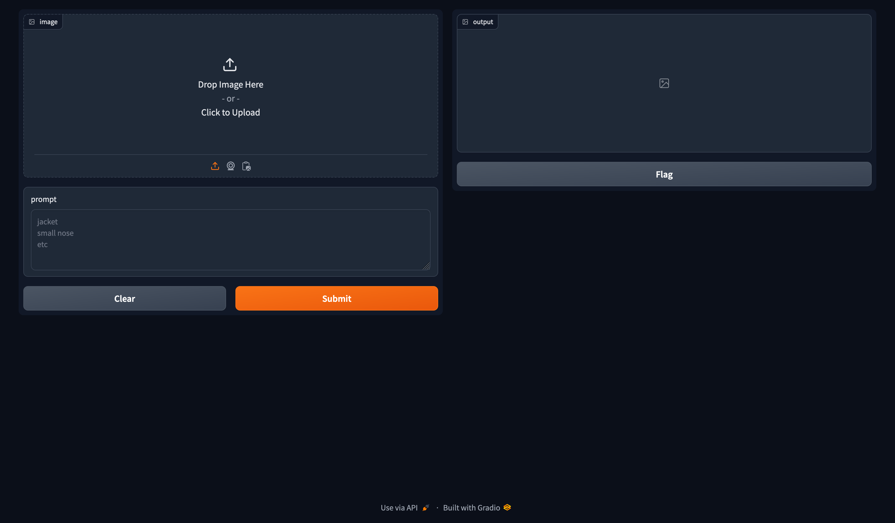

# Prompting for Object Detection

## Introduction

We implement a simple module that detects the objects in an image via text prompts. In our module, we use pretrained [OWLv2](https://arxiv.org/abs/2306.09683) provided by [HuggingFace](https://huggingface.co/docs/transformers/en/tasks/zero_shot_object_detection). 

## Setting Up the Environment

1. Install [Conda](https://conda.io/projects/conda/en/latest/user-guide/install/index.html), if not already installed.
2. Clone the repository
    ~~~
    git clone https://github.com/byrkbrk/prompting-for-object-detection.git
    ~~~
3. Change the directory:
    ~~~
    cd prompting-for-object-detection
    ~~~
4. For macos, run:
    ~~~
    conda env create -f prompting-for-od_macos.yaml
    ~~~
    For linux or windows, run:
    ~~~
    conda env create -f prompting-for-od_linux.yaml
    ~~~
5. Activate the environment:
    ~~~
    conda activate prompting-for-od
    ~~~

## Prompts

Check it out how to use:

~~~
python3 detect.py -h
~~~

Output:

~~~
Detects bounding boxes for given image and text prompts

positional arguments:
  image_name            Name of the image file that be processed. Note image
                        file must be in 'segmentation-images' directory
  text_prompts          Text prompts for the model

options:
  -h, --help            show this help message and exit
  --image_size IMAGE_SIZE [IMAGE_SIZE ...]
                        Size (height, width) to which the image be transformed
  --device DEVICE       Device that be used during inference
~~~

### Example usage
~~~
python3 detect.py dogs.jpg "jacket" "small nose" --image_size 1024 1024
~~~

The output image with bounding boxes (see below, on the right) will be saved into `detected-images` folder.

  
  

## Detecting via Gradio

To run the gradio app on your local computer, execute

~~~
python3 app.py
~~~
Then, visit the url [http://127.0.0.1:7860](http://127.0.0.1:7860) to open the interface seen below.

  

